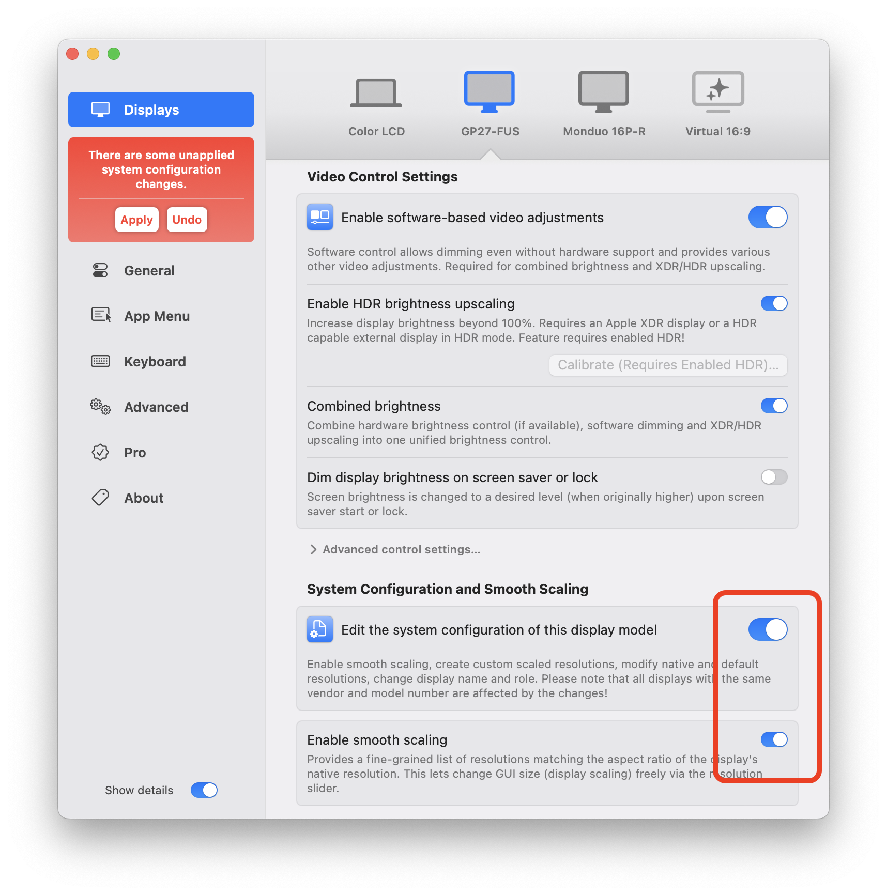

+++
author = "YYK"
title = "Mac开启HiDPI，优化2K显示器效果"
date = "2024-10-14"
categories = [
    "教程",
]
tags = [
    "mac",
]
+++

# 2K显示器在Mac上显示的问题
2K显示器分辨率不低，够日常使用。但是，2K显示器接到 MacBook 上后字体显示的很小，换成 1080P 分辨率显示效果又特别模糊。不过只要强行给 MacBook 开启 HiDPI 后，就能解决这一问题。

# 什么是 HiDPI ？
> 它使用横纵 2 个物理像素也就是 4 个物理像素来显示 1 个像素区域，结果就是图像的细节得到翻倍、更清晰、边缘更平滑。
>
> 拿 13 寸的 MacBook Pro 举例，它的屏幕物理分辨率是 2560 x 1600，所以原生的 HiDPI 分辨率就是 1280x800。更高的一档 1440x900 HiDPI 缩放分辨率，则是虚拟出一个 2880x1800 的分辨率，再进行软缩放输入。所以你能发现苹果的电脑总是有很高的分辨率。
>
简单来说，HiDPI让分辨率更高的显示器上能够渲染和传统屏幕看起来大小相同、却更加清晰的图象。

# 开启 HiDPI 的方法
开启 HiDPI 的方法有很多，这里我使用的是 **[BetterDisplay](https://github.com/waydabber/BetterDisplay)** ，简单操作，安装后直接就可以修改了。
> 真正通过修改配置的方式打开原生的HiDPI ，一旦通过该app开启之后，不再 需要依赖任何软件，直接体验原生高分辨率支持！！！
>
>该功能是免费功能，不需购买pro，感谢开发者的巨大贡献！
(引用：解决2K 显示器的尴尬！为MacBook 开启HiDPI（新方法支持M1）-zz的秘密基地 (zzbloc.top))

# 安装方法：
1. 从 **[BetterDisplay](https://github.com/waydabber/BetterDisplay)** 中下载最新版本，手动安装；
2. Homebrew 安装 `brew install --cask betterdisplay`

# 2K显示器开启 HiDPI 后，全屏显示方法
> [Fully scalable HiDPI desktop · waydabber/BetterDisplay Wiki (github.com)](https://github.com/waydabber/BetterDisplay/wiki/Fully-scalable-HiDPI-desktop)
>
To enable the flexible scaling feature:
1. Start the app and open the app menu (locate the BetterDisplay icon in the menu bar).
2. Open `Settings` (the gear icon at the bottom of the menu).
3. Navigate to the `Displays` section and select the desired display,
4. Enable the `Edit the default system configuration of this display model` feature under the display you want to make scalable,
5. Enable the `Enable flexible scaling` option just below it as it appears.
6. If you did this for all the relevant displays, click on the `Apply` button in the red area that appears when the changes are made.
7. Enter your administrator level credentials and then reboot.
8. After reboot, use the resolution sliders in the app menu to scale the desktop.

参考
- [为 macOS 10.15 开启 HiDPI，让 2K 显示器更舒适 - 少数派](https://sspai.com/post/57549#!)
- [谈谈 HiDPI —— 是什么，为什么，怎么做 | Sukka's Blog](https://blog.skk.moe/post/hidpi-what-why-how/)
- [解决2K 显示器的尴尬！为MacBook 开启HiDPI（新方法支持M1）-zz的秘密基地](https://zzbloc.top/archives/turn-on-hidpi-for-macbook)
